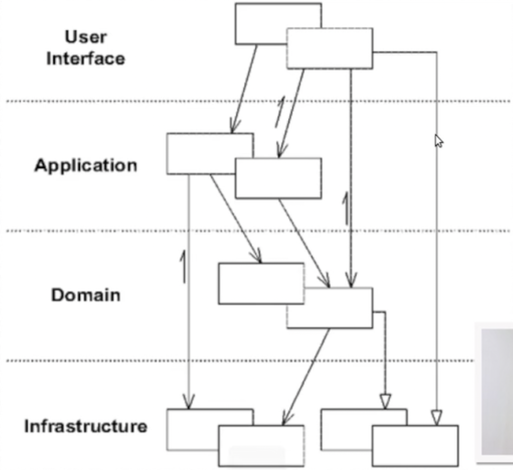
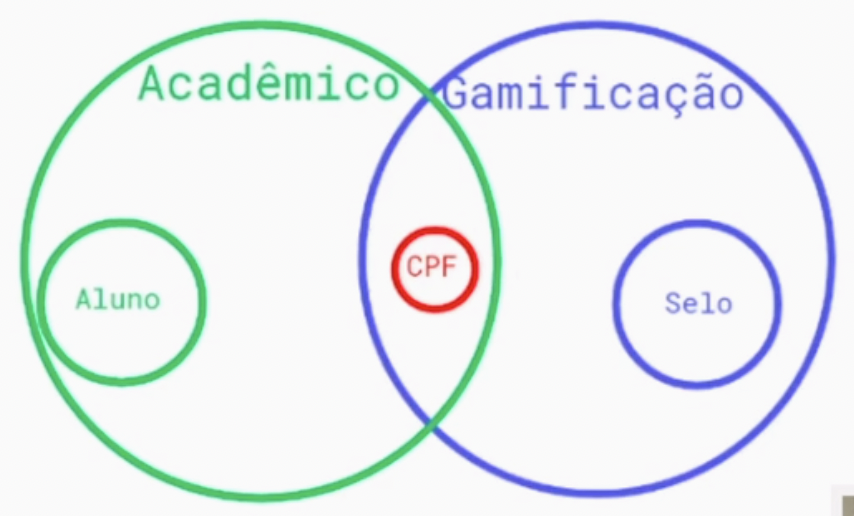

### [Summary of the Domain Driven Design concepts](https://medium.com/@ruxijitianu/summary-of-the-domain-driven-design-concepts-9dd1a6f90091)

* **Ubiquitous Language**: dominio/indicacao/Indicacao.java
* **Entities**: dominio/aluno/Aluno.java
* **Value Objects**: dominio/aluno/CPF.java
* **Aggregates**: dominio/aluno/Aluno.java
* **Domain Events**: aplicacao/aluno/MatricularAluno.java, DomainEvent.java,
* **Factories**: dominio/aluno/FabricaDeAluno.java
* **Services**: aplicacao/aluno/MatricularAluno.java
* **Repositories**: infraestrutura/aluno/RepositorioDeAluno*.java
* **Layered Architecture**: conceito de arquitetura em camadas. A ideia é manter o conhecimento do domínio focado e não espalhado por diferentes componentes da aplicação, como Ui, banco de dados, camada de persistência etc.
  
* **Bounded Contexts**: modulazirar e separar contextos, na aplicação existe o pacote academico que tem tudo relacionado a matricula, indicacao e etc, e o pacote gamificacao contendo tudo de gamificacao, exemplo no [repositorio](https://github.com/DeveloperArthur/monolito-modular)
  